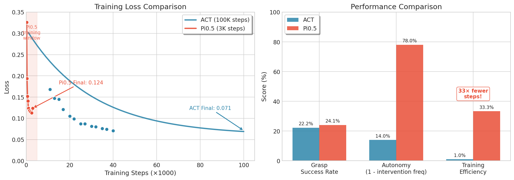

# SO-ARM101 Imitation Learning: ACT vs Pi0.5

<p align="center">
  
</p>

A comparative study of two imitation learning approaches for robotic manipulation on the SO-ARM101 6-DoF robot arm using the [LeRobot](https://github.com/huggingface/lerobot) framework.

## 🎯 Task Description

**Pick-and-Place Task**: Grasp a red cube (1-inch or 4-inch) and place it into a gray bowl.

<p align="center">
  
</p>

## 📊 Results Summary

| Metric | ACT (Behavior Cloning) | Pi0.5 (VLM Fine-tuning) |
|--------|------------------------|-------------------------|
| **Model Parameters** | ~55M | 3.6B (65× larger) |
| **Training Steps** | 100,000 | 3,000 (33× fewer) |
| **Training Time** | ~3 hours | ~2-3 hours |
| **Grasp Success Rate** | 8/36 (22.2%) | 13/54 (24.1%) |
| **Human Interventions** | 6 times / 7 eps | 2 times / 9 eps |
| **Intervention Frequency** | 0.86 / episode | 0.22 / episode **(↓74%)** |

### Key Finding

> Despite similar grasp success rates, **Pi0.5 demonstrates significantly higher autonomy** with 74% fewer human interventions required. This suggests that the pre-trained VLM backbone provides better generalization to edge cases, even with 33× fewer training steps.

## 🔬 Methods

### 1. ACT (Action Chunking with Transformers)

- **Architecture**: ResNet18 (dual camera) + Transformer Encoder-Decoder + VAE
- **Training**: From scratch on collected demonstrations
- **Paper**: [Learning Fine-Grained Bimanual Manipulation with Low-Cost Hardware](https://arxiv.org/abs/2304.13705)

### 2. Pi0.5 (Vision-Language-Action Model)

- **Architecture**: PaliGemma 2B (frozen VLM) + Action Head
- **Training**: Fine-tuning from `lerobot/pi05_base` checkpoint
- **Paper**: [π0: A Vision-Language-Action Flow Model for General Robot Control](https://www.physicalintelligence.company/blog/pi0)

## 📈 Training Curves

<p align="center">
  
</p>

| Stage | ACT Loss | Pi0.5 Loss |
|-------|----------|------------|
| Initial | 0.168 | 0.326 |
| Final | 0.071 | 0.124 |

## 🛠️ Experimental Setup

### Hardware

| Component | Specification |
|-----------|---------------|
| Robot Arm | SO-ARM101 (6-DoF, Feetech servos) |
| Cameras | 2× USB cameras (640×480 @ 30fps) |
| Camera Views | Front (environment) + Handeye (wrist-mounted) |

### Data Collection

- **Episodes**: 60 total (30 with side-view camera, 30 with top-view camera)
- **Total Frames**: ~10,877 frames
- **Collection Method**: Teleoperation with leader-follower arm setup

### Training Configuration

<table>
<tr>
<th>ACT</th>
<th>Pi0.5</th>
</tr>
<tr>
<td>

```yaml
# ACT Configuration
vision_backbone: resnet18
dim_model: 512
n_heads: 8
n_encoder_layers: 4
n_decoder_layers: 1
chunk_size: 100
use_vae: true
latent_dim: 32

# Training
steps: 100,000
batch_size: 8
learning_rate: 1e-5
gpu: RTX 4090 (24GB)
```

</td>
<td>

```yaml
# Pi0.5 Configuration
base_model: lerobot/pi05_base
vlm_backbone: PaliGemma (gemma_2b)
trainable_params: 3.6B

# Training
steps: 3,000
batch_size: 8
learning_rate: 2.5e-5
warmup_steps: 1,000
dtype: bfloat16
gpu: A100-SXM4 (80GB)
```

</td>
</tr>
</table>

## 🔍 Failure Analysis

Most grasp failures were **not due to positioning errors**, but rather **insufficient gripper opening amplitude**, causing the gripper to miss the bottom edge of the cube.

**Hypothesized Cause**: The handeye camera's field of view does not fully cover the gripper, leading to incomplete perception of gripper state during grasping.

**Potential Improvements**:
- Adjust handeye camera angle to fully capture gripper
- Add a third camera dedicated to gripper observation
- Include more "wide-open gripper" demonstrations in training data

## 📁 Project Structure

```
SO-ARM101-Imitation-Learning/
├── README.md
├── configs/
│   ├── act_config.yaml
│   └── pi05_config.yaml
├── results/
│   ├── training_curves.png
│   ├── act_training_log.txt
│   └── pi05_training_log.txt
├── videos/
│   ├── act_inference.mp4
│   └── pi05_inference.mp4
├── assets/
│   ├── demo.gif
│   ├── task_setup.png
│   └── hardware_setup.png
└── scripts/
    └── plot_training_curves.py
```

## 🚀 Quick Start

### Prerequisites

```bash
# Create conda environment
conda create -n lerobot python=3.10.18 ffmpeg=7.1.1 -c conda-forge
conda activate lerobot

# Clone LeRobot and install
git clone https://github.com/huggingface/lerobot.git
cd lerobot
pip install -e ".[feetech]"
```

### Training ACT

```bash
python -m lerobot.scripts.train \
    --dataset.repo_id=xjhu-76/so101_pick_place \
    --policy.type=act \
    --output_dir=outputs/act_training \
    --steps=100000 \
    --policy.device=cuda
```

### Training Pi0.5

```bash
python -m lerobot.scripts.train \
    --policy.path=lerobot/pi05_base \
    --dataset.repo_id=xjhu-76/so101_pick_place \
    --output_dir=outputs/pi05_training \
    --steps=3000 \
    --batch_size=8
```

### Inference

```bash
python -m lerobot.scripts.control_robot \
    --robot.type=so101_follower \
    --policy.path=outputs/act_training/checkpoints/100000/pretrained_model
```

## 📚 References

1. Zhao, T. Z., et al. "Learning Fine-Grained Bimanual Manipulation with Low-Cost Hardware." RSS 2023.
2. Black, K., et al. "π0: A Vision-Language-Action Flow Model for General Robot Control." Physical Intelligence, 2024.
3. Cadene, R., et al. "LeRobot: State-of-the-art Machine Learning for Real-World Robotics." Hugging Face, 2024.

## 📄 License

This project is licensed under the Apache License 2.0 - see the [LICENSE](LICENSE) file for details.

## 🙏 Acknowledgments

- [Hugging Face LeRobot Team](https://github.com/huggingface/lerobot) for the excellent framework
- [Physical Intelligence](https://www.physicalintelligence.company/) for Pi0 research
- SO-ARM101 hardware documentation

---

